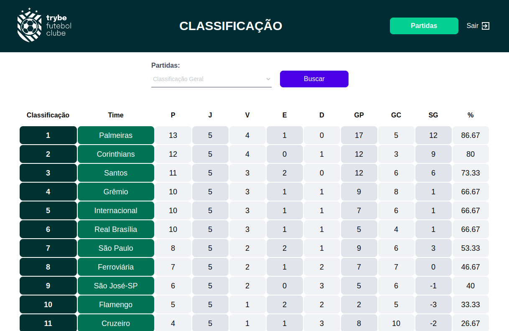

# Trybe Futebol Cube (Soccer Club) ⚽

This Project shows a leaderboard of all soccer teams in a competition, and lets you add teams, matches, and scores.

<strong>First commit:</strong> on Sep 27, 2022.

<strong>Here I had to exercise:</strong> POO, TDD, Node.js, Express, Typescript, Sequelize, mySQL, docker.

This is a full-stack JavaScript Project, but the front-end came already coded by the school [Trybe](https://www.betrybe.com/).




# How to run it:

<details>
 <summary><strong> You need to have installed:</strong></summary><br />
 - Unix based Operational System <br />
 - node version >= 16.14.0 LTS <br />
 - Docker <br />
 - Docker-compose version >= 1.29.2 <br />
</details>
 

command: `npm install` <br />
Use Docker, command: `npm run compose:up`

Open front-end on http://localhost:3000/login <br />

  login info:
*    login: admin@admin.com
*    senha(password): secret_admin


# Files/Folders Ownership

Here you find a list of files and or folders according to the ownership.

<details>
 <summary><strong>🙋‍♀️ I coded myself:</strong></summary><br />
   
  ```markdown  
  app/
    backend/
      src/ 
        controllers/
        database/
          migrations/ (except 99999999999999-create-z.js)
          Models/ (except ExampleModel.ts & index.ts)
        helpers/
        interfaces/
        middlewares/ (except error.middleware.ts)
        routes/
        services/
        tests/
      Dockerfile
    frontend/
      Dockerfile
      packages.npm
  README.md
  ```
 
 </details>


<details>
 <summary><strong>🧑‍🤝‍🧑 I coded partially - the scholl has coded some of it:</strong></summary><br />
 
 ```markdown   
  app/
    backend/
      src/
        app.ts
 ```
 
 </details>


<details>
 <summary><strong>🧛 coded by a teacher or a teammate:</strong></summary><br />
   
 ```markdown  
  app/
    backend/
      helpers/
        BcryptService.ts -> ref. school class code
      middlewares/
        error.middleware.ts -> ref. school classes material and project revision class code
  ```
 
 </details>

<details>
 <summary><strong>🏫 coded by the school:</strong></summary><br />
   
  ```markdown  
   all others not mentioned before.
  ```
 
 </details>
 
 #

✨ all icons used here are from:  [EmojiPedia](https://emojipedia.org/). 

#### 🚧 README under construction 🚧
